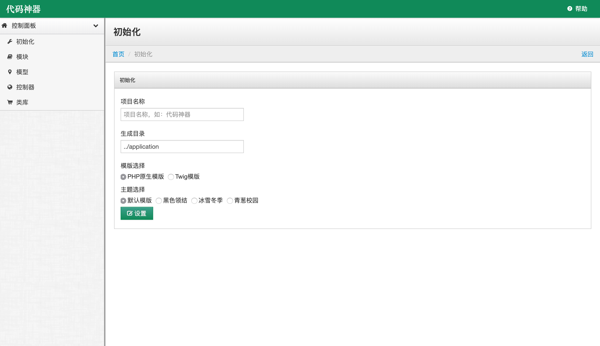

# 一、系统简介

代码生成器(CH)，是一个基于Codeigniter框架而研发的自动代码生成系统，可生成以下功能：

- 快速生成模版，一键生成控制器、模型、视图
- 快速构建登录、CRUD、搜索、排序、表单校验等功能
- 支持PHP原生模版和Twig模版

# 二、系统安装

## 2.1 代码简介

代码目录涉及3个目录：

- system: CodeIgniter框架，版本为2.1.x
- public: 外部可访问目录
- helper: 代码生成器相关代码，原CI框架为`application`目录。这里生成的代码放在`application`目录里。

## 2.2 系统安装

## 2.2.1 配置web访问
将项目放在web目录中，指向public下的index.php，配置完成后即可访问（helper下`log`和`cache`目录给写权限）。效果图如下:

## 2.2.2 配置数据库
配置用于生成代码的数据库配置，配置路径：`helper/config/database.php`。配置的账号需要有`information_schema`读取权限，导入数据库模块依赖SQL：`helper/docs/sql/helper.sql`。

## 2.2.3 生成代码

- 分别点击：初始化、模块、模型、控制器
- 修改`public/index.php`中75行的应用目录改为`application`，重新访问项目根目录(账号`admin`，密码`123456`)。 

访问示例：

